# 🐾 Desktop Journal Companion

<p align="center"></p>

<p align="center">一只可以互动的像素桌面小猫，和一间记录日记、心情与日常任务的手帐小屋。</p>

<p align="center"><a href="https://github.com/meyyy-G/pet-desktop/releases"><strong>⬇️ 前往 Releases 下载 Windows 版本</strong></a></p>

> 项目仍在开发中。Release 中的已发布版本可能落后于仓库当前源码；下载前请查看对应版本的说明。

## 项目介绍

Desktop Journal Companion 是面向 Windows 的桌面陪伴应用。程序由 Python / PySide6 驱动：桌宠使用透明 Qt 窗口，手帐使用 Qt WebEngine 展示 HTML、CSS 和 JavaScript 页面，并通过 QWebChannel 与本地数据读写层通信。

小猫会根据无互动时长、需求值和你的操作切换动作。双击桌宠可打开手帐，记录日记与心情；Home 页面还提供轻量的任务清单。

## 目前能做什么

| 区域 | 当前实现 |
| --- | --- |
| 桌宠 | 透明无边框窗口、拖动与落地动画、单击抚摸、双击打开手帐、右键喂食／玩耍／睡觉／治疗／置顶／退出、系统托盘入口。 |
| Home | 当天问候与日期、七种心情选择、当月迷你日历、可增删改和勾选的任务清单。 |
| Diary | 按日期读取和保存日记、字数显示、文本快捷标记、编辑区展开、未保存内容确认。 |
| Calendar | 月历翻页、回到今天、查看有日记或心情记录的日期、点击日期打开日记。 |
| Chat | 消息输入与固定的演示回复；**尚未接入 AI API**，消息没有持久化。 |
| Task / Focus | 独立 Task 页是视觉预览，未与 Home 任务清单联动；Focus 导航不可用，计时和右侧部分统计为展示内容。 |

### 桌宠行为与状态

- 自然动作由状态机管理：无互动约 10 分钟坐下、约 20 分钟打哈欠、约 30 分钟躺下；互动动作及需求动作可暂时覆盖自然动作。
- 饱食度、心情值、精力值在**程序运行期间**按各自间隔下降；关闭期间不继续扣减。数值变化会保存到本地。
- 喂食提升饱食度；玩耍提升心情，但需要足够的饱食度和精力；睡觉补充精力；单击抚摸提升心情。操作后会短暂显示状态面板。
- 需求值降低时，小猫会出现难过、困倦、哭泣、生气或生病等对应动画与提示。生病时普通互动受限，可从右键菜单开始治疗。
- 拖动桌宠会触发搬运与落地动作；打开手帐及在 Diary 页输入时，也有相应的陪伴动画。
- 桌宠位置和置顶选项会保存；启动时会尽量把窗口调整回可见屏幕内。

### 手帐与数据

- 日记按日期保存为本地 JSON。输入时不会自动保存；切换日期或关闭手帐时，如有未保存修改，会提示保存、放弃或取消。当前页面的独立 Save 按钮被隐藏，界面中的 “Auto saved” 文案也不代表输入即自动保存。
- Home 可选择当月日期并记录心情；记录会显示在 Home、Diary 和 Calendar 中。日记与心情是两套独立数据。
- Home 任务清单支持添加、修改、完成和删除，数据保存在 Qt WebEngine 的 `localStorage` 中，**不是**日记目录中的 JSON，也未与独立 Task 页同步。
- Diary 的“Recent Entries”卡片目前是演示摘要，点击会跳转到相应日期，但摘要文字和字数并非从真实日记生成。
- 右侧摘要的心情与任务完成比例会跟随记录更新；Focus 时长、趋势描述、Due Next 等内容目前仍是静态展示。

## 界面预览

以下截图展示当前五个页面。Task 页目前仍是视觉预览，截图中的任务和筛选控件尚未与 Home 任务清单联动；Chat 页也尚未连接 AI 服务。

<p align="center">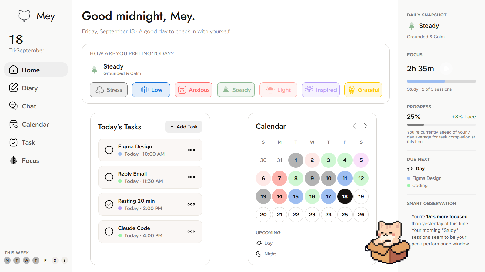</p>
<p align="center">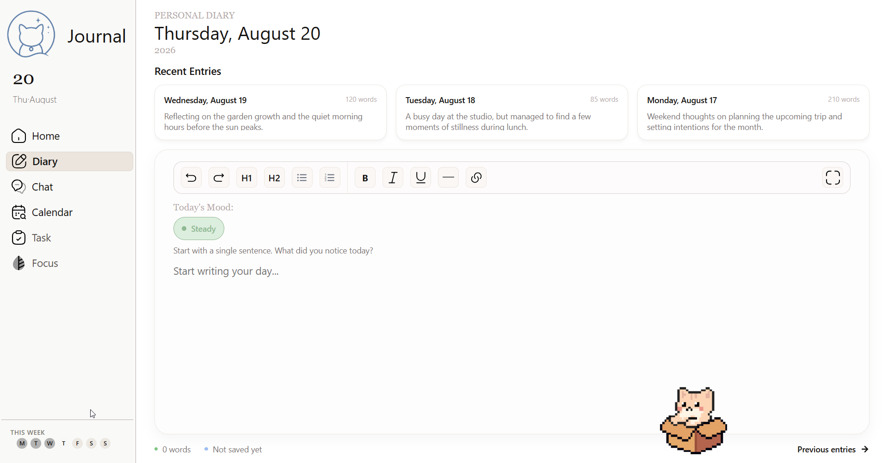</p>
<p align="center">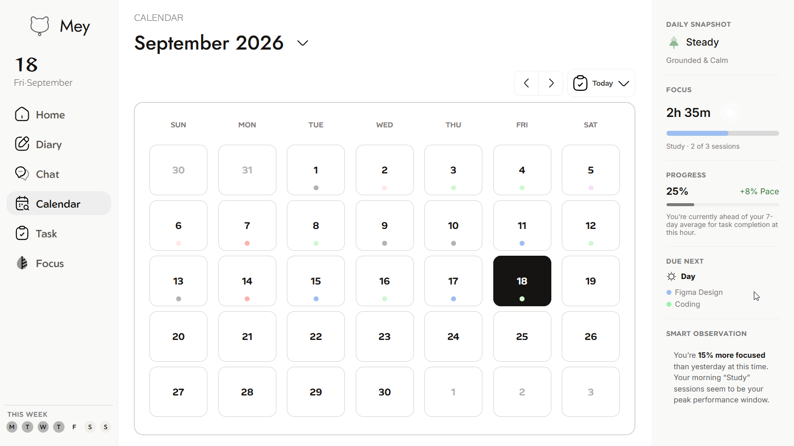</p>
<p align="center">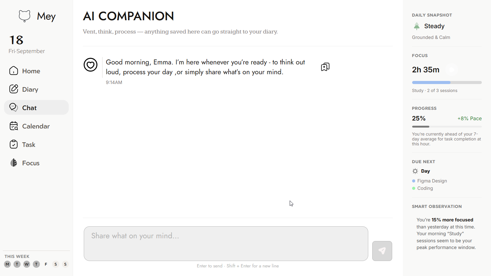</p>
<p align="center">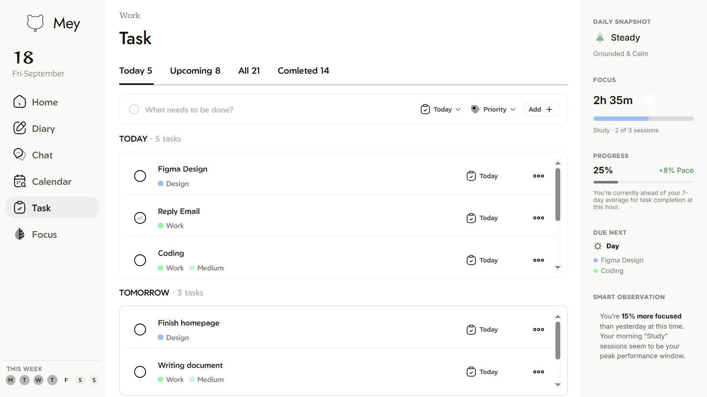</p>

## 桌宠动作预览

### 自然动作

没有互动时，小猫会从站立张望逐渐切换到坐下、打哈欠和躺下。下面的 GIF 展示这些日常姿态；具体切换还会受到当前需求状态影响。

<p align="center">
  
  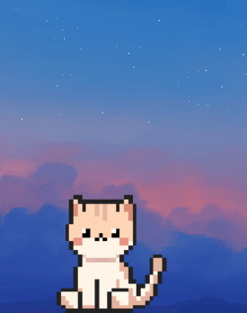
  
  
</p>
<p align="center"><em>站立张望 · 坐下 · 打哈欠 · 躺下</em></p>

### 日常互动

单击可以抚摸小猫，拖动时会有搬运和落地动作；右键菜单可选择喂食、玩耍或睡觉。

<p align="center">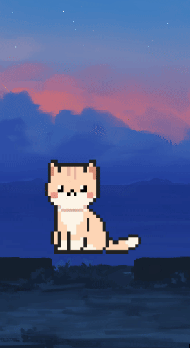</p>

### 需求与心情提示

饱食度、心情值或精力值降低时，小猫会显示对应提示，并可能切换到难过、困倦、生气、哭泣或生病等动作。

<p align="center">
  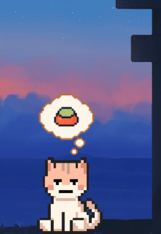
  
  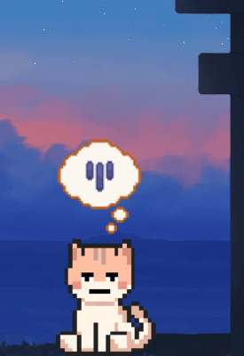
  
  
  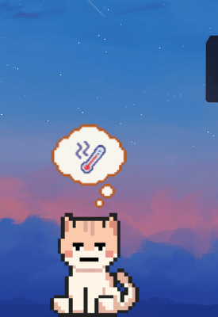
</p>

### 生病与治疗

小猫生病后，普通互动会暂时受限。通过右键菜单开始治疗，治疗期间会播放单独的动画与提示。

<p align="center">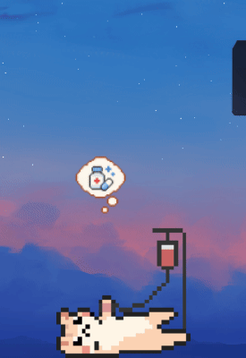</p>

### 写日记时的陪伴

打开手帐后，小猫会切换到陪伴姿态；在 Diary 页面输入内容时，会出现跟随写日记的专属动作。

<p align="center">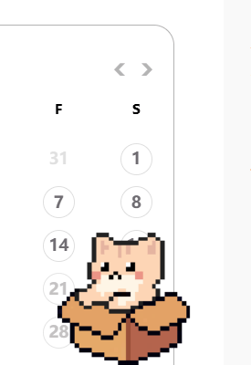</p>
<p align="center">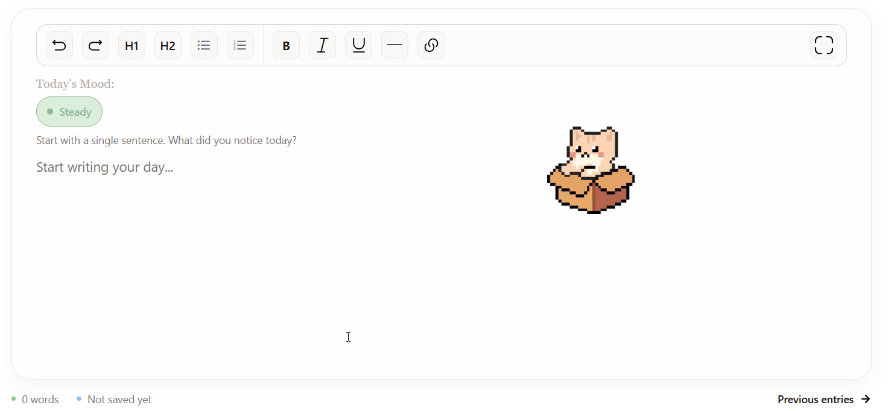</p>

## 下载与运行

在 [GitHub Releases](https://github.com/meyyy-G/pet-desktop/releases) 选择一个版本，下载其中的 Windows `DesktopPet*.exe`。已打包的单文件程序无需另装 Python；首次启动可能因解包而稍慢。当前主要面向 64 位 Windows 10/11，未提供其他平台的构建与验证。

启动后，小猫会出现在桌面上。单击抚摸，双击打开手帐，右键查看互动菜单；也可以通过系统托盘打开手帐或退出。

> 发布包包含运行所需的私有视觉资源。请不要把 `dist/` 中的 EXE 当作可公开素材的源码替代品。

## 从源码运行

本仓库公开应用代码和 README 预览图，**不公开完整动画帧、Web UI 图片／SVG／字体和其他原创视觉素材**。因此只克隆公开仓库并安装依赖，不能还原完整界面，也可能因缺少素材而无法正常运行或打包。下面的步骤适用于已具备完整本地资源的开发环境。

```powershell
git clone https://github.com/meyyy-G/pet-desktop.git
cd pet-desktop
py -3.13 -m venv .venv
.venv\Scripts\python.exe -m pip install -r requirements.txt
.\run_app.bat
```

也可以执行 `.venv\Scripts\python.exe src\desktop_pet_app.py`。运行依赖见 `requirements.txt`；目前使用 Python 3.13 开发和构建。

完整本地资源的主要位置：

```text
assets/
├── animations/      # 桌宠动作、状态面板与提示图
├── images/          # 应用图标与 README 演示图
└── web/
    ├── font/        # Web 字体
    └── svg/         # Web UI 图标与插画
```

其中 `animations/`、`web/` 及部分 `images/` 文件由 `.gitignore` 排除，不应直接提交到公开仓库。

## 本地打包

在具有完整私有资源的 Windows 开发环境中：

```powershell
.venv\Scripts\python.exe -m pip install -r requirements-dev.txt
.\build.bat
```

`DesktopPet.spec` 使用 PyInstaller 的 onefile 模式，包含应用代码及运行所需资源，并排除未使用的部分 Qt 模块和调试资源。产物为 `dist\DesktopPet.exe`。`build/` 和 `dist/` 是本地生成目录，不纳入 Git；面向用户的 EXE 应作为 GitHub Release 附件单独上传。

## 项目结构

```text
pet-desktop/
├── assets/                     # 预览图及本地私有运行素材
├── src/
│   ├── desktop_pet_app.py      # 程序入口
│   └── desktop_pet/
│       ├── app.py              # QApplication、托盘与桌宠窗口
│       ├── paths.py            # 资源和用户数据路径
│       ├── settings.py         # 桌宠设置存储
│       ├── pet/                # 动画、行为状态机、互动、物理与需求值
│       ├── diary/              # 手帐窗口、WebChannel、日记／心情存储
│       └── web/
│           ├── index.html      # Home / Diary / Chat / Calendar / Task 页面
│           ├── scripts/        # 按页面拆分的 JavaScript 模块
│           └── styles/         # 基础、布局及各页面样式
├── tests/                      # Web 布局与交互测试
├── DesktopPet.spec             # PyInstaller 打包配置
├── build.bat                   # Windows 构建脚本
├── run_app.bat                 # 源码启动脚本
├── requirements.txt           # 运行依赖
└── requirements-dev.txt       # 开发／打包依赖
```

## 本地数据与隐私

源码运行时，日记、心情、桌宠状态与位置等 JSON 数据默认位于项目 `data/`；打包运行时默认位于 `%LOCALAPPDATA%\DesktopPet`。可通过 `DESKTOP_PET_DATA_DIR` 环境变量覆盖此目录。Home 任务另由 Qt WebEngine 的本地存储管理。

这些数据保存在用户自己的电脑上，不应加入 Git 仓库或 Release。当前 Chat 是本地界面演示，没有连接任何 AI 服务。

## 开发状态

后续计划包括真正的 AI 对话、与 Home 清单联动的完整 Task 页、可用的 Focus 计时、真实统计摘要、更多设置与互动。上述计划功能**目前尚未实现**。

## 许可

仓库中的公开代码采用 [MIT License](LICENSE)。未公开的原创美术与视觉素材不随公开仓库提供。

---

Desktop Journal Companion is a Windows desktop pet and journal built with Python, PySide6, Qt WebEngine and QWebChannel. The current app supports pet interactions, local diary and mood records, a Home task list, and a calendar. The Chat page uses a canned demo reply; the standalone Task and Focus experiences are not implemented yet. The public repository omits the private visual assets required to reproduce the complete packaged app.
