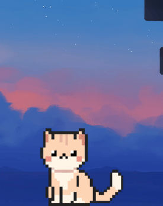
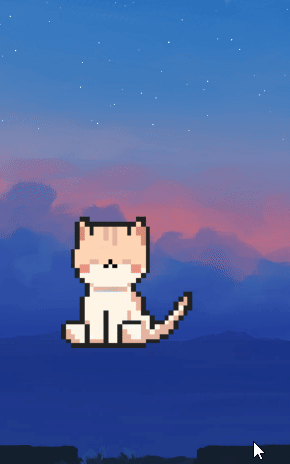
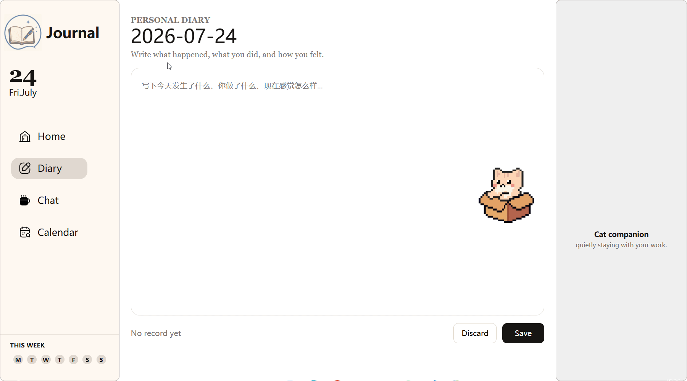

# 🐾 Desktop Journal Companion

A cozy desktop companion built with **PySide6** that combines a virtual pet with a personal journaling system.

The project aims to create a relaxing desktop experience where users can write diaries, track their mood, and interact with a virtual cat that responds naturally through animations and state transitions.

---

## ✨ Features

### 🐱 Desktop Pet
- Animated desktop cat
- Physics-based dragging
- Natural animation state machine
- Idle, Sitting, Gaping and Laydown behaviors
- Inactivity-based state transitions

### 📖 Diary
- Daily journal editor
- Automatic save
- Calendar navigation
- Recorded date highlighting

### 😊 Mood Tracker
- Daily mood selection
- Mood history
- Mood persistence

### 📅 Calendar
- Monthly calendar
- Recorded diary indicators
- Quick date navigation

### 💬 Chat
- Chat interface (UI implemented)

---

## 🛠 Tech Stack

- Python
- PySide6
- Qt WebEngine
- QWebChannel
- HTML
- CSS
- JavaScript

---

## 📂 Project Structure

```
DesktopJournalCompanion
│
├── app.py
├── pet_window.py
├── diary_window.py
├── animation.py
├── pet_state.py
├── diary_store.py
├── mood_store.py
├── web/
│   ├── index.html
│   ├── style.css
│   └── js/
└── assets/
```

---

## 🚧 Current Status

This project is still under active development.

### Planned Features

- Task System
- Pet Interaction (Feed / Play / Pet)
- AI Chat Integration
- Statistics Dashboard
- Settings
- More Pet Animations

---

## 📸 Preview

### 🐱 Desktop Pet

<p align="center">
  
  
  
  
  
</p>

<p align="center">
  <em>Natural animation state transitions: Looking → Sitting → Gaping → Laydown → Drag Interaction</em>
</p>

---

### 📖 Diary System

<p align="center">
  
</p>

<p align="center">
  <em>Write daily journals with calendar navigation and mood tracking.</em>
</p>

## 📄 License

MIT License

# 🐾 桌面日记陪伴助手

这是一个使用 **PySide6** 开发的桌面陪伴应用，将 **桌面宠物** 与 **日记记录** 结合在一起。

用户可以记录每天的生活、心情，并拥有一只能够根据状态自然变化动画的小猫作为桌面伙伴。

---

## ✨ 已实现功能

- 🐱 桌面宠物
  - 自然动画状态机
  - 拖拽交互
  - Idle / Sitting / Gaping / Laydown 状态
  - 无互动行为切换

- 📖 日记系统
  - 每日日记
  - 自动保存
  - 日历导航
  - 已记录日期高亮

- 😊 心情记录
  - 每日 Mood
  - 数据持久化

- 📅 日历页面

- 💬 Chat 页面（UI）

---

## 🚧 开发计划

- Task 系统
- 喂食 / 抚摸 / 玩耍
- AI 对话
- 数据统计
- 更多宠物动画
- 设置页面

本项目仍在持续开发中。